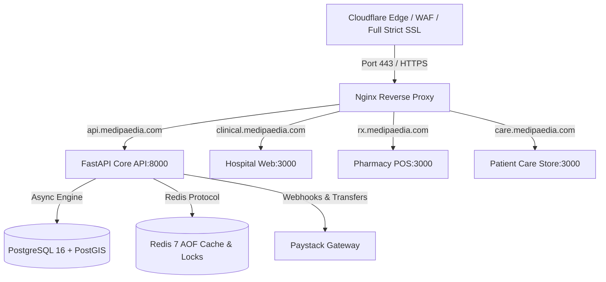

# Medipaedia SaaS - Production & Staging Deployment Guide

Comprehensive DevOps, Containerization, and Site Reliability engineering documentation for deploying the **Medipaedia Multi-Tenant Healthcare & Pharmacy Marketplace SaaS** across local Proxmox staging servers and DigitalOcean production infrastructure with Cloudflare edge security.

---

## 🏗️ Architecture & Subdomain Map



| Subdomain | Target Service | Internal Port | Purpose |
| :--- | :--- | :--- | :--- |
| `api.medipaedia.com` | `core-api` | `8000` | Multi-Tenant FastAPI, EMR, Auth & Fintech API |
| `clinical.medipaedia.com` | `hospital-web` | `3000` | Hospital OPD Reception, Nurse Triage & Doctor SOAP Workstation |
| `rx.medipaedia.com` | `pharmacy-pos` | `3000` | Pharmacy Dispensary POS, QR Verifier & Payouts |
| `care.medipaedia.com` | `patient-store` | `3000` | Patient Ghana Card Wallet, Prescriptions & Geospatial Rx Search |

---

## 🖥️ 1. Proxmox VE (Local Staging Setup)

### Step 1: Create Ubuntu 24.04 VM or LXC Container
1. Allocate **4 vCPUs**, **8 GB RAM**, and **50 GB SSD**.
2. Install Docker & Docker Compose:
   ```bash
   curl -fsSL https://get.docker.com | sh
   sudo usermod -aG docker $USER
   ```
3. Install `pnpm` and Node.js:
   ```bash
   sudo npm install -g pnpm@9
   ```

### Step 2: Clone & Launch Staging
```bash
git clone https://github.com/medipaedia/medipaedia.git /opt/medipaedia
cd /opt/medipaedia

# Copy and configure environment variables
cp .env.example .env

# Execute automated staging deployment
bash scripts/deploy-staging.sh
```

---

## 🌊 2. DigitalOcean Production Deployment

### Step 1: Droplet & Network Provisioning
1. Launch an **Ubuntu 24.04 x64 Droplet** (4 vCPUs / 8 GB RAM / 160 GB SSD) in the London or Frankfurt region.
2. Attach a **DigitalOcean Floating IP** to the droplet.
3. Configure UFW Firewall rules:
   ```bash
   sudo ufw default deny incoming
   sudo ufw default allow outgoing
   sudo ufw allow 22/tcp
   sudo ufw allow 80/tcp
   sudo ufw allow 443/tcp
   sudo ufw enable
   ```

### Step 2: Environment Configuration (`.env.production`)
Create `/opt/medipaedia/.env`:
```ini
ENVIRONMENT=production
PROJECT_NAME="Medipaedia Core API"

# Database
POSTGRES_USER=medipaedia_prod_admin
POSTGRES_PASSWORD=SuperStrongPostgresPassword2026!
POSTGRES_DB=medipaedia_db

# Redis
REDIS_PASSWORD=SuperStrongRedisPassword2026!

# JWT Auth & Cryptographic E-Prescriptions
SECRET_KEY=long_random_64_character_hex_string_for_jwt_tokens
PRESCRIPTION_HMAC_SECRET=long_random_32_character_hex_for_hmac_sha256_rx

# Paystack Payment Gateway
PAYSTACK_SECRET_KEY=sk_live_abcdef1234567890
PAYSTACK_PUBLIC_KEY=pk_live_abcdef1234567890

# Cloudflare & Domains
NEXT_PUBLIC_API_URL=https://api.medipaedia.com
```

### Step 3: Production Rollout
```bash
cd /opt/medipaedia
bash scripts/deploy-prod.sh
```

---

## 🛡️ 3. Cloudflare Edge, DNS & SSL Configuration

1. **DNS A-Records**:
   - `api.medipaedia.com` -> `[Droplet Floating IP]` (Proxied: **ON** 🟠)
   - `clinical.medipaedia.com` -> `[Droplet Floating IP]` (Proxied: **ON** 🟠)
   - `rx.medipaedia.com` -> `[Droplet Floating IP]` (Proxied: **ON** 🟠)
   - `care.medipaedia.com` -> `[Droplet Floating IP]` (Proxied: **ON** 🟠)

2. **SSL/TLS Encryption**:
   - Set SSL mode to **Full (Strict)**.
   - Generate an **Origin CA Certificate** in Cloudflare Dashboard (valid for 15 years).
   - Save the certificate to `/opt/medipaedia/docker/nginx/ssl/medipaedia.crt` and private key to `/opt/medipaedia/docker/nginx/ssl/medipaedia.key`.

3. **Cloudflare WAF Rules**:
   - Enable **Rate Limiting**: Block IPs exceeding 120 requests/minute on `api.medipaedia.com/api/v1/auth/*`.
   - Enable **Bot Fight Mode** to block malicious scrapers.
   - Require TLS 1.2+ with HSTS enabled.

---

## 💾 4. Automated Database Backups & Sentry Monitoring

### Setup Daily Crontab for PostGIS Backups
```bash
sudo crontab -e
```
Add the following line to execute encrypted database backups every night at 2:00 AM:
```cron
0 2 * * * /opt/medipaedia/scripts/backup-db.sh >> /var/log/medipaedia_backup.log 2>&1
```

### Disaster Recovery: Restore Database Snapshot
```bash
# Decompress and stream SQL snapshot into PostGIS database container
gunzip < /var/backups/medipaedia/medipaedia_db_20260816_020000.sql.gz | docker exec -i medipaedia-prod-db psql -U medipaedia_prod -d medipaedia_db
```

---

## 🚀 5. Operational Health Verification

Check container health status:
```bash
docker compose -f docker/docker-compose.prod.yml ps
```

Verify backend health probe:
```bash
curl -I https://api.medipaedia.com/api/v1/health
```
Response:
```http
HTTP/2 200 
content-type: application/json
server: cloudflare
```
